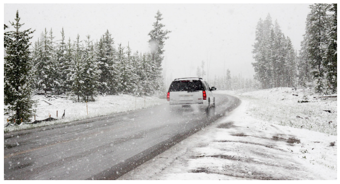
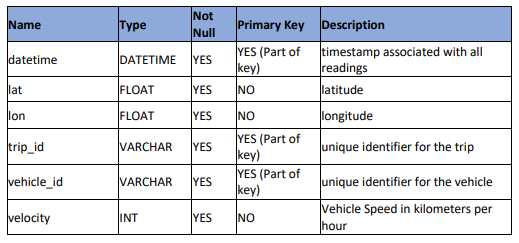
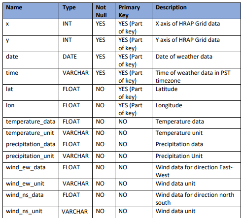
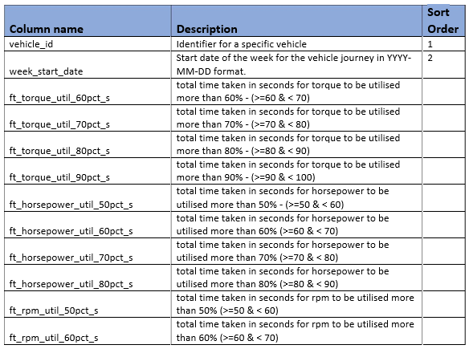
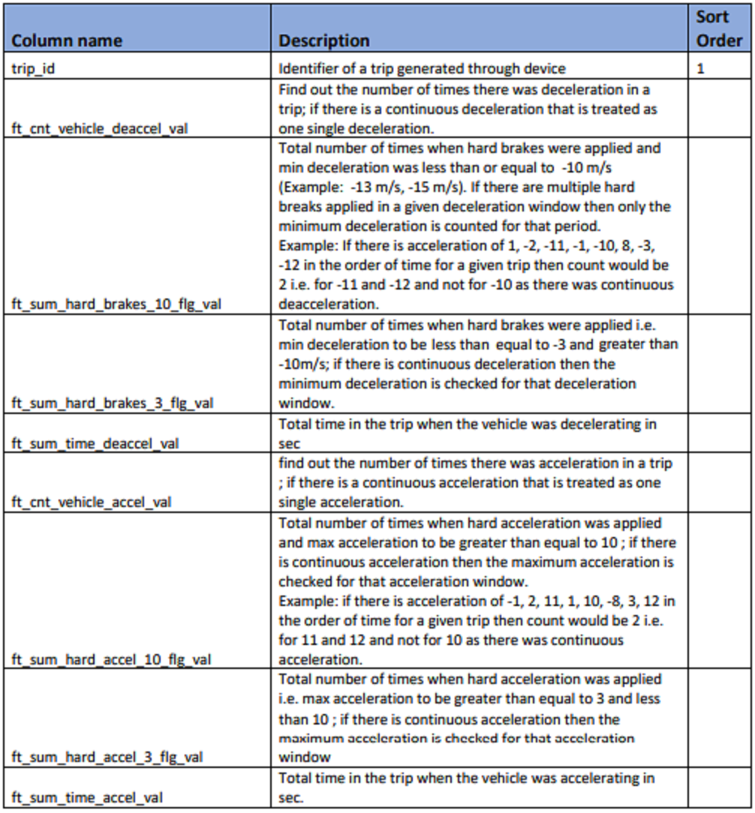
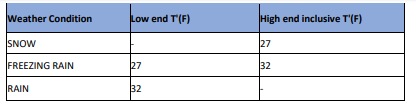
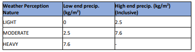
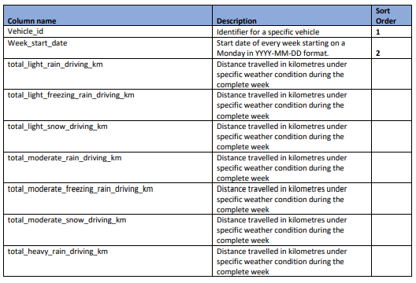
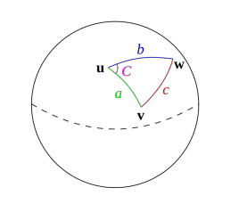

# Quantum Black - Data Engineering Hackathon

## Problem Statement
ACRTA road taxation data engineering

Astro City Road transport authority (ACRTA) in US have come up with an idea to use car registration renewal charges to provide indirect incentives to safe drivers. Also, providing subsidies to certain areas as per the extreme climatic conditions in terms of heavy snow or rain.

Problem statement that we have been provided is to “Develop inputs for a model that predicts the chances of having a vehicle accident based on driving conditions. This model will help the transport authority to understand risk patterns and act upon them.”

This output then would be utilized so as to come up for a risk-based taxation on different drivers and locations as per crash-prone weather conditions.

Use cases would be –

**Imposing “unsafe driving tax” on drivers to provide a positive feedback loop which may be revisited every year by looking at the past year trip data based on the driving patterns.
Lower the tax in the regions where the climatic conditions lead them to become a crash-prone site.**

 
### Data Description
**1. Drive Data (Connected car data) – Data coming from the car-mounted devices, which provides you with the car statistics every second. This information will include – Speed, acceleration, engine temperature and other car statistics.**

**2. Trip – Parameters associated with location of car such as lattitude, longitude, altitude and other similar parameters**

**3. Weather – Weather condition at different latitude & longitude during different times each day.**

**4. Vehicle Specifications – Different vehicle technical specifications which comes from the manufacturer of the car.**

### Submission/Output Format

Using the input data as described above, the participant would need to create features related to different hypothesis around the driving behaviours.

Solution file must be a single zip containing the 3 csvs for 3 kinds of features with the file names as given below:

**Engine Features: engine_features.csv
Drive Features: drive_features.csv
Weather Features: weather_features.csv
The csv files must have the same file names and columns in order so that checks may be done. Failure to do so would result in direct rejection as these would be tested through automated scripts.**

To understand the type of features to create, Please go through the requirements for the features carefully:

 

**1. Engine Features (file name – engine_features.csv)**
Grain - every vehicle aggregated at week start date(Monday) for the complete week in YYYY-MM-DD format.

Sorted - by Vehicle ID and week_start_Date in ascending manner

Hints:

Convert timezone to PST before any calculations
All vehicles from drive data should be in the final output even if you do not have specifications (Fill with 0 if specs are not given)
Active horsepower - Engine load / 255 * Max Torque * RPM / 5252
Horsepower utilization – Active horsepower / Max Horsepower
Torque Utilization - calculated as Engine load/ 255
RPM Utilization – RPM / Maximum horsepower rpm

**2. Drive features(file name – drive_features.csv)**
Grain – Every trip’s aggregated features at a trip id level.

Sorted - by trip_id in ascending manner

Hints:

Acceleration m/s is calculated as a change in velocity over time
If a vehicle keeps on accelerating continuously over a period of time, please treat them as a single acceleration or deacceleration period.
 

Fields and order required in drive_features.csv -

 

**3. Weather features (file name – weather_features.csv)**
Here are the weather conditions for your reference and generating weather feature accordingly

Grain – Every vehicle detail should be aggregated at a week start date.

 
Sorted - by vehicle_id and week_start_date in ascending manner

Hint: convert time zone to PST before any calculations

Assumptions & Hints–

Weather data is already in PST and may not need any timezone conversion. You may consider the weather data to be constant for complete hour basis. For example- if the temperature is given to be 284.51 for 2017-02-14 19:00:00, it would be the same for time 2017-02-14 19:15:45 as well.
Haversine formula must be utilized to measure the distance between any 2 consecutive points in between the trips.
Matches in between datasets must be on geohash precision point 5.
 

Studies have found that - **The haversine formula** determines the great-circle distance between two points on a sphere given their longitudes and latitudes. Important in navigation, it is a special case of a more general formula in spherical trigonometry, the law of haversines, that relates the sides and angles of spherical triangles.

Fields and order required in weather_features.csv -

### Evaluation Criteria & Rules

Least deviation from the actual result would decide the accuracy of the output.
For engine and drive features, we are going to use the absolute percent deviation in between pre-calculated output versus the output provided by you. For weather features, it is going to be calculated as per mean percentage deviation from the actual output.
The final score is calculated using the deviation scores after applying weights as follows
Score = 100[W1(1- engine_deviation) + W2(1- drive_deviation) + W3(1- weather_deviation)]

Quality of code would be judged on the following parameters – functionality, reusability, modularity, documentation, testing and validation.
Should be scalable to be executed on 5 GB data as well.
Please note that scoring is going to be done using an automated script and difference in between the field names or order from the above-defined feature may result in zero scoring/error message due to the failure of the scoring script.
Participants may do multiple submissions. They would have to select on the platform which one to be treated as the final submission. If not selected, the submission with the highest score would be considered as final.
Final winners would be announced only after the submitted code reviews and the analysis of the rest of the document submissions made by the participants.
Only 5 submissions per day are allowed
 

# Leaderboard

* **[Public LB](https://datahack.analyticsvidhya.com/contest/quantumblack-online-hackathon/lb)** : **18th/133 Rank**
* **[Private LB](https://datahack.analyticsvidhya.com/contest/quantumblack-online-hackathon/pvt_lb)** : **17th/133 Rank**

# Note:
 Weather data has not been utilised in the code
